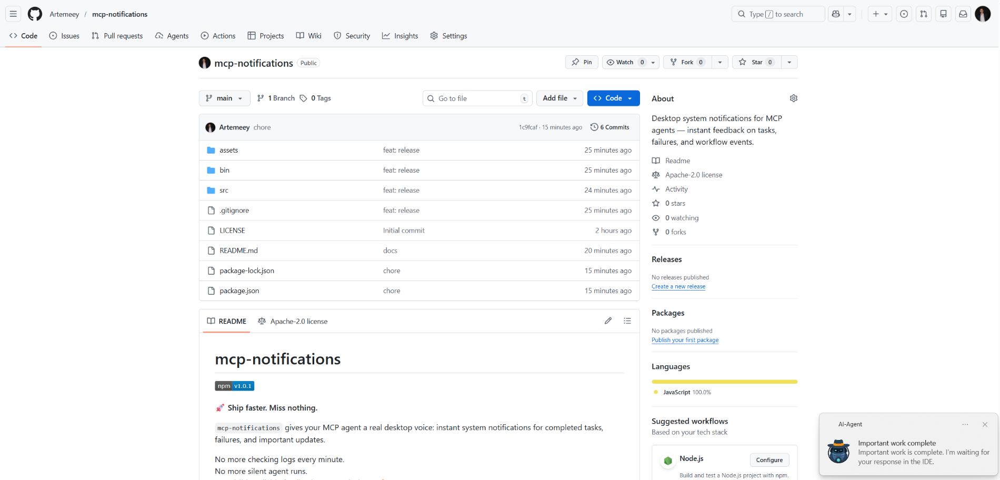

# mcp-notifications

[](https://www.npmjs.com/package/@topvisor/mcp-notifications)

🚀 **Ship faster. Miss nothing.**

`mcp-notifications` lets your MCP agent send desktop notifications for completed tasks, failures, and important updates.

This is especially useful for console AI agents, because they usually have no built-in notifications by default.

No more checking chats every minute.  
No more silent agent responses.  
Just visible, reliable feedback on your desktop. 🔔

## Common problem this solves

You give tasks to several AI agents, then wait and keep checking who already replied.

With `mcp-notifications`, this gets simpler: the agent can notify you on desktop when it needs your input or when work
is done.

## Why teams install this

- ⚡ Immediate feedback from your MCP workflows.
- 🧠 Better focus: let the agent work while you stay on your main task.
- 🖥️ Native OS notifications via `node-notifier`.
- 🧵 Non-blocking behavior: notification sending is queued in background.

## Install globally

Requirements:

- Node.js `>=20`
- npm `>=10`

```bash
npm i -g @topvisor/mcp-notifications
```

Executable name (use this in MCP config):

```bash
mcp-notifications
```

`mcp-notifications` is an MCP server entrypoint (`stdio`), not a one-shot notification command.

## Setup: Codex

Add this to `~/.codex/config.toml`:

```toml
[mcp_servers.notifications]
enabled = true
command = "mcp-notifications"
args = []
```

Restart Codex after config update.

## Setup: Claude Agent

Add MCP server config to your Claude client config file:

```json
{
  "mcpServers": {
    "notifications": {
      "command": "mcp-notifications",
      "args": []
    }
  }
}
```

Then restart Claude client.

## AI Agent Notification Instructions

There are two approaches to notifications: manual and automatic.

Choose the one that works better for your workflow.

### Manual

In a task where you want to be notified, explicitly ask the agent. Example:

```text
Count files in the project; after the task is fully complete, notify me with sound.
```

You can also define sound, topic, and frequency rules inside a specific chat. Example:

```text
Notify me about your replies without sound, include the reply text, and use title: "Large Refactoring"
```

### Automatic

Automatic notifications can be configured globally or per project.

Example instruction to enable automatic notifications for agent replies:

```text
Send `send_notification` after your replies (actual task time >5 seconds or many steps); `play_sound: false`; `app_id: '{put your chat name here}'`
```

Time is a rough threshold and depends on model behavior, so adjust this instruction to your own preferences.

### In Skills

You can also enable notifications in specific skills. Example for a Review skill:

```text
After the review, run `send_notification` with a short summary; `play_sound: true`; `app_id: 'Reviewer {put task id here}'`
```

## Tool

### `send_notification`

Input:

- `title` `string` (required)
- `message` `string` (required)
- `play_sound` `boolean` (optional, default: `false`)
- `icon` `string` (optional, absolute or relative path to image file)
- `app_id` `string` (optional, Windows App User Model ID for toast source)

Example:

```json
{
  "title": "Codex",
  "message": "Deployment completed successfully",
  "play_sound": true,
  "icon": "/opt/mcp-notifications/icons/custom.png",
  "app_id": "Topvisor.Codex"
}
```

## app_id (Windows)

- `app_id` controls the source shown in Windows toast notifications.
- If `app_id` is not set, Windows may show `SnoreToast` as the source.
- You can pass `app_id` in each tool call, or set `MCP_NOTIFICATIONS_APP_ID` as an environment variable for the server.

## Backend selection

You can select notification transport via env `MCP_NOTIFICATIONS_BACKEND`:

- `auto` (default): uses `powershell` in WSL if available, then `wsl-notify-send`, otherwise `node-notifier`
- `powershell`: force `powershell.exe` Windows toast transport (recommended for WSL)
- `wsl-notify-send`: force `wsl-notify-send` command
- `node-notifier`: force `node-notifier` package

## Chat Prompts To Test In Codex

Use these messages directly in chat:

```text
Check send_notification
```

```text
Send a notification without sound: title "Test", message "Check"
```

```text
Send a notification with sound: title "Test", message "Check"
```

```text
Send a notification with app_id "Topvisor.Codex": title "Test", message "Check"
```

```text
Send 3 test notifications in a row without sound
```

Expected tool result in logs/response:

```text
Notification queued
```

## Behavior

- ✅ Uses standard system notification channels.
- 🔊 Uses the standard system notification sound when `play_sound: true`.
- 🤖 Uses bundled Topvisor robot image as default notification icon.
- 🧰 Returns quickly while notifications are delivered in background queue.

## Example 

The AI agent is waiting for you:


